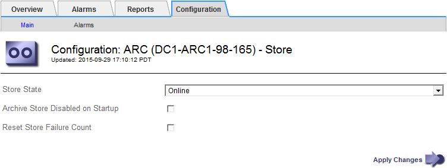

= TSM에 대한 아카이브 상태 및 카운터를 구성합니다
:allow-uri-read: 
:icons: font
:imagesdir: ../media/

[role="lead"]
아카이브 노드가 TSM 미들웨어 서버에 연결된 경우 아카이브 노드의 아카이브 저장소 상태를 온라인 또는 오프라인으로 구성할 수 있습니다. 또한 아카이브 노드가 처음 시작될 때 아카이브 저장소를 비활성화하거나 관련 알람에 대해 추적 중인 실패 수를 재설정할 수 있습니다.

.시작하기 전에
* 를 사용하여 그리드 관리자에 로그인했습니다 link:../admin/web-browser-requirements.html["지원되는 웹 브라우저"].
* 있습니다 link:admin-group-permissions.html["특정 액세스 권한"].

.단계
. 지원 * > * 도구 * > * 그리드 토폴로지 * 를 선택합니다.
. Archive Node_ * > * ARC * > * Store * 를 선택합니다.
. Configuration * > * Main * 을 선택합니다.
+

. 필요에 따라 다음 설정을 수정합니다.
+
** Store State(상태 저장): 구성 요소 상태를 다음 중 하나로 설정합니다.
+
*** 온라인: 아카이브 노드는 스토리지의 객체 데이터를 아카이브 스토리지 시스템에 처리하는 데 사용할 수 있습니다.
*** 오프라인: 아카이브 노드는 스토리지의 객체 데이터를 아카이브 스토리지 시스템에 처리하는 데 사용할 수 없습니다.

** 시작할 때 아카이브 저장소 사용 안 함: 이 옵션을 선택하면 아카이브 저장소 구성 요소는 다시 시작할 때 읽기 전용 상태로 유지됩니다. 대상 아카이브 스토리지 시스템에 대한 스토리지를 영구적으로 해제하는 데 사용됩니다. 대상 아카이브 스토리지 시스템에서 콘텐츠를 수락할 수 없는 경우에 유용합니다.
** Reset Store Failure Count(저장 실패 카운트 재설정): 저장소 오류에 대한 카운터를 재설정합니다. ARVF(Store Failure) 알람을 소거하는 데 사용할 수 있습니다.

. Apply Changes * 를 선택합니다.

.관련 정보
link:managing-archive-node-when-tsm-server-reaches-capacity.html["TSM 서버가 용량에 도달하면 아카이브 노드를 관리합니다"]
