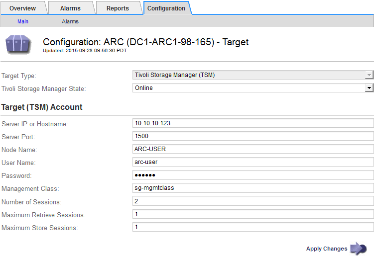

= TSM 미들웨어에 대한 연결을 구성합니다
:allow-uri-read: 
:icons: font
:imagesdir: ../media/

[role="lead"]
아카이브 노드가 TSM(Tivoli Storage Manager) 미들웨어와 통신하려면 여러 설정을 구성해야 합니다.

.시작하기 전에
* 를 사용하여 그리드 관리자에 로그인했습니다 link:../admin/web-browser-requirements.html["지원되는 웹 브라우저"].
* 있습니다 link:admin-group-permissions.html["특정 액세스 권한"].

.이 작업에 대해
이러한 설정이 구성될 때까지 ARC 서비스는 Tivoli Storage Manager와 통신할 수 없기 때문에 주요 알람 상태를 유지합니다.

.단계
. 지원 * > * 도구 * > * 그리드 토폴로지 * 를 선택합니다.
. Archive Node_ * > * ARC * > * Target * 을 선택합니다.
. Configuration * > * Main * 을 선택합니다.
+

. Target Type * 드롭다운 목록에서 * TSM(Tivoli Storage Manager) * 을 선택합니다.
. Tivoli Storage Manager State * 의 경우 * Offline * 을 선택하여 TSM 미들웨어 서버에서 검색을 방지합니다.
+
기본적으로 Tivoli Storage Manager State는 Online으로 설정되어 있으므로 Archive Node는 TSM 미들웨어 서버에서 객체 데이터를 검색할 수 있습니다.

. 다음 정보를 입력합니다.
+
** * 서버 IP 또는 호스트 이름 *: ARC 서비스에서 사용하는 TSM 미들웨어 서버의 IP 주소 또는 정규화된 도메인 이름을 지정합니다. 기본 IP 주소는 127.0.0.1입니다.
** * 서버 포트*: TSM 미들웨어 서버에서 ARC 서비스가 연결할 포트 번호를 지정합니다. 기본값은 1500입니다.
** * 노드 이름 *: 아카이브 노드의 이름을 지정합니다. TSM 미들웨어 서버에 등록한 이름(arc‐user)을 입력해야 합니다.
** * 사용자 이름 *: ARC 서비스가 TSM 서버에 로그인하는 데 사용하는 사용자 이름을 지정합니다. 아카이브 노드에 대해 지정한 기본 사용자 이름(arc‐user) 또는 관리 사용자를 입력합니다.
** * 암호 *: ARC 서비스가 TSM 서버에 로그인하기 위해 사용하는 암호를 지정합니다.
** * 관리 클래스 *: 객체가 StorageGRID 시스템에 저장될 때 관리 클래스가 지정되지 않았거나 지정된 관리 클래스가 TSM 미들웨어 서버에 정의되지 않은 경우 사용할 기본 관리 클래스를 지정합니다.
** * Number of Sessions *: 아카이브 노드 전용 TSM 미들웨어 서버의 테이프 드라이브 수를 지정합니다. 아카이브 노드는 마운트 지점당 최대 1개의 세션을 동시에 생성하고 적은 수의 추가 세션(5개 미만)을 생성합니다.
+
보관 노드를 등록 또는 업데이트할 때 MAXNUMMP(최대 탑재 지점 수)에 대해 설정된 값과 같도록 이 값을 변경해야 합니다. (설정된 값이 없는 경우 REGISTER 명령에서 사용되는 MAXNUMMP의 기본값은 1입니다.)

+
또한 TSM 서버에 대한 MAXSESSIONS 값을 최소한 ARC 서비스에 대해 설정된 세션 수 만큼 큰 숫자로 변경해야 합니다. TSM 서버의 MAXSESSIONS 기본값은 25입니다.

** * Maximum Retrieve Sessions *: ARC 서비스가 검색 작업을 위해 TSM 미들웨어 서버에 열 수 있는 최대 세션 수를 지정합니다. 대부분의 경우 적절한 값은 세션 수에서 최대 저장소 세션을 뺀 수입니다. 저장 및 검색을 위해 하나의 테이프 드라이브를 공유해야 하는 경우 세션 수 와 동일한 값을 지정하십시오.
** * Maximum Store Sessions *: 아카이브 작업을 위해 ARC 서비스가 TSM 미들웨어 서버에 열 수 있는 최대 동시 세션 수를 지정합니다.
+
타겟 아카이브 스토리지 시스템이 꽉 차고 검색할 수만 있는 경우를 제외하고 이 값은 1로 설정해야 합니다. 검색을 위해 모든 세션을 사용하려면 이 값을 0으로 설정합니다.

. Apply Changes * 를 선택합니다.

