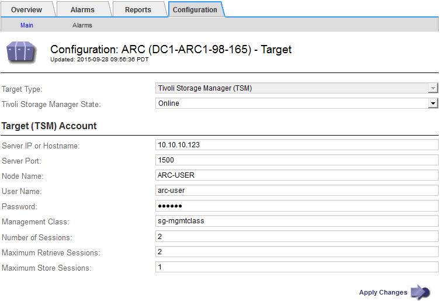

= TSM 미들웨어 세션에 맞게 아카이브 노드를 최적화합니다
:allow-uri-read: 
:icons: font
:imagesdir: ../media/

[role="lead"]
아카이브 노드의 세션을 구성하여 TSM(Tivoli Server Manager)에 연결되는 아카이브 노드의 성능을 최적화할 수 있습니다.

.시작하기 전에
* 를 사용하여 그리드 관리자에 로그인했습니다 link:../admin/web-browser-requirements.html["지원되는 웹 브라우저"].
* 있습니다 link:admin-group-permissions.html["특정 액세스 권한"].

.이 작업에 대해
일반적으로 아카이브 노드가 TSM 미들웨어 서버에 열려 있는 동시 세션 수는 TSM 서버가 아카이브 노드 전용으로 사용하는 테이프 드라이브 수로 설정됩니다. 나머지 테이프 드라이브는 검색을 위해 할당되는 동안 보관을 위해 하나의 테이프 드라이브가 할당됩니다. 그러나 스토리지 노드가 아카이브 노드 복제본에서 재구축되거나 아카이브 노드가 읽기 전용 모드로 작동하는 경우 최대 검색 세션 수를 동시 세션 수와 같도록 설정하여 TSM 서버 성능을 최적화할 수 있습니다. 그 결과, 모든 드라이브를 동시에 검색할 수 있으며, 해당하는 경우 이들 드라이브 중 하나를 스토리지에도 사용할 수 있습니다.

.단계
. 지원 * > * 도구 * > * 그리드 토폴로지 * 를 선택합니다.
. Archive Node_ * > * ARC * > * Target * 을 선택합니다.
. Configuration * > * Main * 을 선택합니다.
. 최대 검색 세션 * 을 * 세션 수 * 와 동일하게 변경합니다.
+

. Apply Changes * 를 선택합니다.

