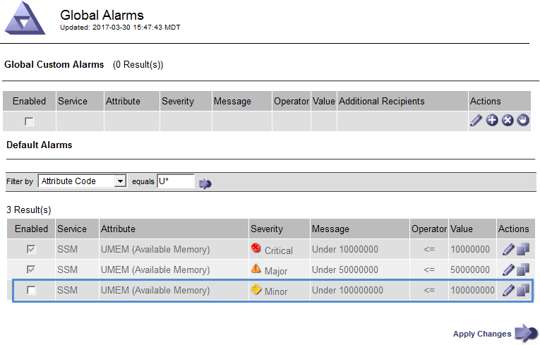

= 알람 관리(기존 시스템)
:allow-uri-read: 
:icons: font
:imagesdir: ../media/

[role="lead"]
StorageGRID 알람 시스템은 정상 작동 중에 가끔 발생하는 문제 지점을 식별하는 데 사용되는 레거시 시스템입니다.

NOTE: 기존 알람 시스템은 계속 지원되지만, 알림 시스템은 상당한 이점을 제공하며 사용이 간편합니다.

== 알람 등급(레거시 시스템)

레거시 알람은 상호 배타적인 두 가지 알람 클래스 중 하나에 속할 수 있습니다.

* 기본 알람은 각 StorageGRID 시스템과 함께 제공되며 수정할 수 없습니다. 그러나 기본 알람을 비활성화하거나 글로벌 사용자 정의 알람을 정의하여 재정의할 수 있습니다.
* 글로벌 사용자 정의 알람은 StorageGRID 시스템에서 지정된 유형의 모든 서비스의 상태를 모니터링합니다. 글로벌 사용자 정의 알람을 생성하여 기본 알람을 재정의할 수 있습니다. 새 글로벌 사용자 지정 알람을 만들 수도 있습니다. 이 기능은 StorageGRID 시스템의 사용자 지정 조건을 모니터링하는 데 유용합니다.

== 알람 트리거 논리(레거시 시스템)

StorageGRID 속성이 알람 클래스(기본값 또는 글로벌 사용자 정의)와 알람 심각도 수준의 조합에 대해 TRUE로 평가되는 임계값에 도달하면 레거시 알람이 트리거됩니다.

[cols="1a,1a,1a,3a"]
|===
| 아이콘을 클릭합니다 | 색상 | 알람 심각도입니다 | 의미 

 a| 
image:../media/icon_alarm_yellow_notice.gif["노란색 사각형 아이콘"]
 a| 
노란색
 a| 
주의
 a| 
노드가 그리드에 연결되어 있지만 정상적인 작동에 영향을 주지 않는 비정상적인 상태가 존재합니다.

 a| 
image:../media/icon_alert_yellow_minor.png["연한 주황색 다이아몬드 아이콘"]
 a| 
연한 주황색
 a| 
경미합니다
 a| 
노드가 그리드에 연결되어 있지만 향후 운영에 영향을 미칠 수 있는 비정상적인 조건이 존재합니다. 에스컬레이션을 방지하려면 조사해야 합니다.

 a| 
image:../media/icon_alert_orange_major.png["진한 주황색 다이아몬드 아이콘"]
 a| 
진한 주황색
 a| 
전공
 a| 
노드가 그리드에 연결되어 있지만 현재 작업에 영향을 미치는 비정상적인 상태가 존재합니다. 에스컬레이션을 방지하려면 즉각적인 주의가 필요합니다.

 a| 
image:../media/icon_alert_red_critical.png["빨간색 x 아이콘"]
 a| 
빨간색
 a| 
심각
 a| 
노드가 그리드에 연결되었지만 정상 작동을 중지한 비정상적인 조건이 존재합니다. 문제를 즉시 해결해야 합니다.

|===
알람 심각도 및 해당 임계값은 모든 숫자 특성에 대해 설정할 수 있습니다. 각 관리 노드의 NMS 서비스는 현재 속성 값을 구성된 임계값에 대해 지속적으로 모니터링합니다. 알람이 트리거되면 지정된 모든 직원에게 알림이 전송됩니다.

Normal(정상)의 심각도 수준은 알람을 트리거하지 않습니다.

속성 값은 해당 속성에 대해 정의된 활성화된 경보 목록에 대해 평가됩니다. 다음 순서로 알람 목록을 확인하여 속성에 대해 정의되고 활성화된 알람이 있는 첫 번째 알람 클래스를 찾습니다.

. Critical에서 Notice 까지 알람 심각도를 갖는 Global Custom 알람
. Critical에서 Notice 까지 알람 심각도를 갖는 기본 알람.

상위 알람 클래스에서 해당 속성에 대해 활성화된 알람이 발견된 후 NMS 서비스는 해당 클래스 내에서만 평가합니다. NMS 서비스는 다른 낮은 우선 순위 클래스에 대해 평가되지 않습니다. 즉, 속성에 대해 활성화된 글로벌 사용자 정의 경보가 있는 경우 NMS 서비스는 글로벌 사용자 정의 알람에 대해서만 특성 값을 평가합니다. 기본 알람은 평가되지 않습니다. 따라서 속성에 대해 활성화된 기본 알람은 알람을 트리거하는 데 필요한 기준을 충족할 수 있지만 동일한 속성에 대해 지정된 기준을 충족하지 않는 Global Custom 알람이 활성화되었기 때문에 트리거되지 않습니다. 알람이 트리거되지 않고 알림이 전송되지 않습니다.

=== 알람 트리거링 예

이 예제를 사용하여 전역 사용자 정의 알람과 기본 알람이 트리거되는 방식을 이해할 수 있습니다.

다음 예제에서 속성에 글로벌 사용자 정의 알람과 기본 알람이 정의되어 있고 다음 표에 나와 있는 것처럼 활성화되어 있습니다.

[cols="1a,2a,2a"]
|===
|  | 글로벌 사용자 지정 알람 임계값(활성화됨) | 기본 알람 임계값(활성화됨) 

 a| 
주의
 a| 
>= 1500
 a| 
>= 1000

 a| 
경미합니다
 a| 
>= 15,000
 a| 
>= 1000

 a| 
전공
 a| 
>= 150,000
 a| 
>= 250,000입니다

|===
속성 값이 1000일 때 평가되면 알람이 트리거되지 않고 알림이 전송되지 않습니다.

전체 사용자 정의 알람이 기본 알람보다 우선합니다. 1000의 값이 글로벌 사용자 지정 알람의 심각도 수준의 임계값에 도달하지 않습니다. 그 결과, 알람 레벨이 정상으로 평가됩니다.

위 시나리오 이후 Global Custom(전체 사용자 정의) 경보가 비활성화되면 아무 것도 변경되지 않습니다. 새 알람 레벨이 트리거되기 전에 속성 값을 재평가해야 합니다.

전역 사용자 정의 경보를 비활성화한 상태에서 특성 값을 재평가하면 기본 알람의 임계값에 대해 속성 값이 평가됩니다. 알람 수준은 알림 수준 경보를 트리거하고 지정된 직원에게 이메일 알림을 보냅니다.

=== 동일한 심각도의 경보

동일한 속성에 대해 두 개의 전역 사용자 정의 알람이 동일한 심각도를 가지면 "하향식" 우선 순위로 알람이 평가됩니다.

예를 들어, UMEM이 50MB로 떨어지면 첫 번째 경보가 트리거되지만(=50000000) 그 아래에 있는 알람은 트리거되지 않습니다(\<=100000000).

image::../media/alarm_order.gif[글로벌 사용자 지정 알람의 예]

순서가 반대로 바뀌면 UMEM이 100MB로 떨어지면 첫 번째 알람(\<=100000000)이 트리거되지만 그 아래에 있는 알람(= 50000000)은 트리거되지 않습니다.

image::../media/alarm_order_reversed.gif[글로벌 사용자 지정 알람의 예]

=== 알림

알림은 서비스의 알람 발생 또는 상태 변경을 보고합니다. 알람 알림은 e-메일 또는 SNMP를 통해 보낼 수 있습니다.

알람 임계값에 도달할 때 여러 알람 및 알림이 전송되지 않도록 하려면 해당 속성의 현재 알람 심각도에 대해 알람 심각도를 확인합니다. 변경 사항이 없으면 추가 작업이 수행되지 않습니다. 즉, NMS 서비스가 시스템을 계속 모니터링함에 따라 알람을 발생시키고 속성에 대한 알람 조건을 처음으로 인식한 경우에만 알림을 전송합니다. 속성에 대한 새 값 임계값에 도달하여 감지되면 알람 심각도가 변경되고 새 알림이 전송됩니다. 조건이 정상 수준으로 되돌아오면 알람이 해제됩니다.

알람 상태 알림에 표시되는 트리거 값은 소수점 셋째 자리까지 반올림됩니다. 따라서 특성 값 1.9999는 임계값이 (<) 2.0 미만인 알람을 트리거하지만 알람 알림은 트리거 값을 2.0으로 표시합니다.

=== 새로운 서비스

새 그리드 노드 또는 사이트를 추가하여 새 서비스를 추가하면 기본 알람과 글로벌 사용자 지정 경보가 상속됩니다.

=== 알람 및 표

표에 표시된 알람 속성은 시스템 수준에서 비활성화할 수 있습니다. 테이블의 개별 행에 대해서는 알람을 비활성화할 수 없습니다.

예를 들어 다음 표에는 사용 가능한 두 가지 중요 항목(VMFI) 경보가 나와 있습니다. (* 지원 * > * 도구 * > * 그리드 토폴로지 * 를 선택합니다. 그런 다음 * _Storage Node_ * > * SSM * > * Resources * 를 선택합니다.)

Critical level VMFI alarm이 triggering 되지 않도록 VMFI alarm을 disable 할 수 있다(현재 Critical alarm이 모두 green로 테이블에 나타남). 그러나 하나의 VMFI 알람이 위험 수준 알람으로 표시되고 다른 하나는 녹색으로 표시되도록 테이블 행에서 단일 알람을 비활성화할 수는 없습니다.

image::../media/disabling_alarms.gif[용적 페이지에 위험 알람이 표시됩니다]

== 현재 알람 확인(레거시 시스템)

레거시 알람은 시스템 속성이 알람 임계값에 도달할 때 트리거됩니다. 또는 레거시 알람 목록을 줄이거나 지우려면 알람을 확인할 수 있습니다.

.시작하기 전에
* 를 사용하여 그리드 관리자에 로그인해야 합니다 link:../admin/web-browser-requirements.html["지원되는 웹 브라우저"].
* 경보 승인 권한이 있어야 합니다.

.이 작업에 대해
기존 알람 시스템은 계속 지원되기 때문에 새 알람이 발생할 때마다 현재 알람 페이지의 기존 알람 목록이 증가합니다. 일반적으로 경보를 무시하거나(경고를 통해 시스템을 더 잘 볼 수 있으므로) 알람을 확인할 수 있습니다.

NOTE: 필요에 따라 알림 시스템으로 완전히 전환한 경우 각 기존 알람을 비활성화하여 기존 알람의 개수에 추가되지 않도록 할 수 있습니다.

경보를 승인하면 알람이 다음 심각도 수준에서 트리거되거나 해결되었다가 다시 발생하지 않는 한 그리드 관리자의 현재 알람 페이지에 더 이상 표시되지 않습니다.

NOTE: 기존 알람 시스템은 계속 지원되지만, 알림 시스템은 상당한 이점을 제공하며 사용이 간편합니다.

.단계
. 지원 * > * 알람(레거시) * > * 현재 알람 * 을 선택합니다.
+
image::../media/current_alarms_page.png[Current Alarms Page(현재 알람 페이지]

. 테이블에서 서비스 이름을 선택합니다.
+
선택한 서비스에 대한 경보 탭이 나타납니다(* 지원 * > * 도구 * > * 그리드 토폴로지 * > *_그리드 노드 _ * > *_서비스_ * > * 경보 *).

+
image::../media/alarms_acknowledging.png[알람 확인]

. 알람의 * 확인 * 확인란을 선택하고 * 변경 사항 적용 * 을 클릭합니다.
+
대시보드나 현재 알람 페이지에 알람이 더 이상 나타나지 않습니다.

+

NOTE: 알람을 확인하면 승인이 다른 관리 노드로 복사되지 않습니다. 따라서 다른 Admin Node에서 대시보드를 볼 경우 활성 알람이 계속 표시될 수 있습니다.

. 필요한 경우 확인된 알람을 봅니다.
+
.. 지원 * > * 알람(레거시) * > * 현재 알람 * 을 선택합니다.
.. Show Acknowledged Alarms * 를 선택합니다.
+
확인된 알람이 표시됩니다.

+
image::../media/current_alarms_page_show_acknowledged.png[현재 알람 페이지 표시가 확인됨]

== 기본 알람 보기(레거시 시스템)

모든 기본 레거시 알람 목록을 볼 수 있습니다.

.시작하기 전에
* 를 사용하여 그리드 관리자에 로그인해야 합니다 link:../admin/web-browser-requirements.html["지원되는 웹 브라우저"].
* 있습니다 link:../admin/admin-group-permissions.html["특정 액세스 권한"].

NOTE: 기존 알람 시스템은 계속 지원되지만, 알림 시스템은 상당한 이점을 제공하며 사용이 간편합니다.

.단계
. 지원 * > * 알람(레거시) * > * 전체 알람 * 을 선택합니다.
. 필터 기준 으로 * 특성 코드 * 또는 * 특성 이름 * 을 선택합니다.
. 등호의 경우 별표를 입력합니다. `*`
. 화살표를 클릭합니다 image:../media/icon_nms_right_arrow.gif["화살표 아이콘"] 또는 * Enter * 를 누릅니다.
+
모든 기본 알람이 나열됩니다.

+
image::../media/global_alarms.gif[Global Alarms(전체 알람) 페이지]

== 과거 알람 및 알람 빈도 검토(레거시 시스템)

문제를 해결할 때 레거시 알람이 이전에 트리거된 빈도를 검토할 수 있습니다.

.시작하기 전에
* 를 사용하여 그리드 관리자에 로그인해야 합니다 link:../admin/web-browser-requirements.html["지원되는 웹 브라우저"].
* 있습니다 link:../admin/admin-group-permissions.html["특정 액세스 권한"].

NOTE: 기존 알람 시스템은 계속 지원되지만, 알림 시스템은 상당한 이점을 제공하며 사용이 간편합니다.

.단계
. 다음 단계에 따라 일정 기간 동안 트리거된 모든 알람 목록을 가져옵니다.
+
.. 지원 * > * 알람(레거시) * > * 내역 알람 * 을 선택합니다.
.. 다음 중 하나를 수행합니다.
+
*** 기간 중 하나를 클릭합니다.
*** 사용자 지정 범위를 입력하고 * 사용자 지정 쿼리 * 를 클릭합니다.

. 다음 단계에 따라 특정 속성에 대해 알람이 트리거되는 빈도를 확인합니다.
+
.. 지원 * > * 도구 * > * 그리드 토폴로지 * 를 선택합니다.
.. grid node_ * > *_service 또는 component_ * > * Alarms * > * History * 를 선택합니다.
.. 목록에서 속성을 선택합니다.
.. 다음 중 하나를 수행합니다.
+
*** 기간 중 하나를 클릭합니다.
*** 사용자 지정 범위를 입력하고 * 사용자 지정 쿼리 * 를 클릭합니다.
+
알람은 시간순으로 역순으로 나열됩니다.

.. 경보 기록 요청 양식으로 돌아가려면 * 기록 * 을 클릭합니다.

== 전체 사용자 정의 알람 생성(레거시 시스템)

특정 모니터링 요구 사항을 해결하기 위해 기존 시스템에 대해 글로벌 사용자 지정 알람을 사용했을 수 있습니다. 글로벌 사용자 지정 알람에는 기본 알람을 재정의하는 알람 수준이 있거나 기본 알람이 없는 속성을 모니터링할 수 있습니다.

.시작하기 전에
* 를 사용하여 그리드 관리자에 로그인해야 합니다 link:../admin/web-browser-requirements.html["지원되는 웹 브라우저"].
* 있습니다 link:../admin/admin-group-permissions.html["특정 액세스 권한"].

NOTE: 기존 알람 시스템은 계속 지원되지만, 알림 시스템은 상당한 이점을 제공하며 사용이 간편합니다.

전체 사용자 정의 알람은 기본 알람보다 우선합니다. 반드시 필요한 경우가 아니면 기본 알람 값을 변경해서는 안 됩니다. 기본 알람을 변경하면 알람을 트리거할 수 있는 문제가 은폐될 위험이 있습니다.

NOTE: 알람 설정을 변경할 때는 주의하십시오. 예를 들어, 알람의 임계값을 증가해도 기본 문제를 감지하지 못할 수 있습니다. 알람 설정을 변경하기 전에 기술 지원 부서의 변경 사항에 대해 논의하십시오.

.단계
. 지원 * > * 알람(레거시) * > * 전체 알람 * 을 선택합니다.
. Global Custom Alarms(전체 사용자 정의 알람) 테이블에 새 행을 추가합니다.
+
** 새 알람을 추가하려면 * Edit * (편집 *)를 클릭합니다 image:../media/icon_nms_edit.gif["편집 아이콘"] (첫 번째 항목인 경우) 또는 * Insert * (삽입 *)를 선택합니다 image:../media/icon_nms_insert.gif["삽입 아이콘"].
+
image::../media/global_custom_alarms.gif[Global Alarms(전체 알람) 페이지]

** 기본 알람을 수정하려면 기본 알람을 검색합니다.
+
... 필터 기준 아래에서 * 특성 코드 * 또는 * 특성 이름 * 을 선택합니다.
... 검색 문자열을 입력합니다.
+
4개의 문자를 지정하거나 와일드카드(예: a??? 또는 AB *). 별표(*)는 여러 문자를 나타내고 물음표(?)는 단일 문자를 나타냅니다.

... 화살표를 클릭합니다 image:../media/icon_nms_right_arrow.gif["오른쪽 화살표 아이콘"]또는 * Enter * 를 누릅니다.
... 결과 목록에서 * 복사 * 를 클릭합니다 image:../media/icon_nms_copy.gif["복사 아이콘"] 수정할 알람 옆에 있습니다.
+
Default alarm(기본 알람)이 Global Custom alarms(전체 사용자 정의 알람) 테이블에 복사됩니다.

. 전역 사용자 정의 알람 설정을 필요에 따라 변경합니다.
+
[cols="1a,2a"]
|===
| 제목 | 설명 

 a| 
활성화됨
 a| 
확인란을 선택하거나 선택 취소하여 알람을 활성화 또는 비활성화합니다.

 a| 
속성
 a| 
선택한 서비스 또는 구성 요소에 적용 가능한 모든 속성 목록에서 모니터링 중인 특성의 이름과 코드를 선택합니다.
속성에 대한 정보를 표시하려면 * 정보 * 를 클릭합니다 image:../media/icon_nms_info.gif["정보 아이콘"] 속성 이름 옆에 있습니다.

 a| 
심각도입니다
 a| 
알람 레벨을 나타내는 아이콘과 텍스트

 a| 
메시지
 a| 
알람이 발생한 이유(연결 끊김, 저장 공간 10% 미만 등)

 a| 
운영자
 a| 
값 임계값에 대해 현재 속성 값을 테스트하는 연산자:

** = 같음
** > 보다 큼
** 보다 작음
** >= 보다 크거나 같음
** = 보다 작거나 같음
** ≠ 같지 않음

 a| 
값
 a| 
운용자를 사용하여 속성의 실제 값을 기준으로 테스트하는 데 사용되는 알람의 임계값입니다.
항목은 단일 번호, 콜론(1:3)으로 지정된 숫자 범위 또는 숫자와 범위의 쉼표로 구분된 목록이 될 수 있습니다.

 a| 
추가 받는 사람
 a| 
알람이 트리거될 때 알림을 받을 e-메일 주소의 추가 목록입니다. 이것은 * 알람 * > * 이메일 설정 * 페이지에 구성된 메일링 리스트와 함께 사용됩니다. 목록은 쉼표로 구분됩니다.

* 참고: * 메일링 목록을 사용하려면 SMTP 서버 설정이 필요합니다. 메일 그룹을 추가하기 전에 SMTP가 구성되어 있는지 확인합니다.
사용자 정의 알람에 대한 알림은 전체 사용자 정의 또는 기본 알람의 알림을 재정의할 수 있습니다.

 a| 
작업
 a| 
컨트롤 버튼:    image:../media/icon_nms_edit.gif["편집 아이콘"] 행을 편집합니다

를 누릅니다
image:../media/icon_nms_insert.gif["삽입 아이콘"] 행을 삽입합니다

를 누릅니다
image:../media/icon_nms_delete.gif["삭제 아이콘"] 행을 삭제합니다

를 누릅니다
image:../media/icon_nms_drag_and_drop.gif["끌기 아이콘"] 행을 위나 아래로 끕니다

를 누릅니다
image:../media/icon_nms_copy.gif["복사 아이콘"] 행을 복사합니다

|===
. 변경 내용 적용 * 을 클릭합니다.

== 알람 비활성화(기존 시스템)

레거시 알람 시스템의 알람은 기본적으로 활성화되어 있지만 필요하지 않은 알람은 비활성화할 수 있습니다. 새 경보 시스템으로 완전히 전환한 후 기존 경보를 비활성화할 수도 있습니다.

NOTE: 기존 알람 시스템은 계속 지원되지만, 알림 시스템은 상당한 이점을 제공하며 사용이 간편합니다.

=== 기본 알람 비활성화(레거시 시스템)

전체 시스템에 대해 레거시 기본 알람 중 하나를 비활성화할 수 있습니다.

.시작하기 전에
* 를 사용하여 그리드 관리자에 로그인해야 합니다 link:../admin/web-browser-requirements.html["지원되는 웹 브라우저"].
* 있습니다 link:../admin/admin-group-permissions.html["특정 액세스 권한"].

.이 작업에 대해
현재 알람이 트리거된 속성에 대해 알람을 비활성화해도 현재 알람은 지워지지 않습니다. 다음 번에 속성이 알람 임계값을 넘어가면 알람이 비활성화되거나 트리거된 알람을 지울 수 있습니다.

NOTE: 새 경보 시스템으로 완전히 전환할 때까지 기존 경보를 비활성화하지 마십시오. 그렇지 않으면 중요한 작업이 완료되지 못할 때까지 근본적인 문제를 감지하지 못할 수 있습니다.

.단계
. 지원 * > * 알람(레거시) * > * 전체 알람 * 을 선택합니다.
. 기본 알람을 검색하여 비활성화합니다.
+
.. 기본 알람 섹션에서 * Filter by * > * Attribute Code * 또는 * Attribute Name * 을 선택합니다.
.. 검색 문자열을 입력합니다.
+
4개의 문자를 지정하거나 와일드카드(예: a??? 또는 AB *). 별표(*)는 여러 문자를 나타내고 물음표(?)는 단일 문자를 나타냅니다.

.. 화살표를 클릭합니다 image:../media/icon_nms_right_arrow.gif["오른쪽 화살표 아이콘"]또는 * Enter * 를 누릅니다.

+

NOTE: Disabled Defaults * 를 선택하면 현재 비활성화된 모든 기본 알람 목록이 표시됩니다.

. 검색 결과 테이블에서 편집 아이콘을 클릭합니다 image:../media/icon_nms_edit.gif["편집 아이콘"] 비활성화하려는 알람의 경우.
+

+
선택한 알람의 * Enabled * 확인란이 활성화됩니다.

. 사용 * 확인란의 선택을 취소합니다.
. 변경 내용 적용 * 을 클릭합니다.
+
기본 알람은 비활성화됩니다.

=== 전체 사용자 정의 알람 비활성화(레거시 시스템)

전체 시스템에 대해 레거시 글로벌 사용자 정의 알람을 비활성화할 수 있습니다.

.시작하기 전에
* 를 사용하여 그리드 관리자에 로그인해야 합니다 link:../admin/web-browser-requirements.html["지원되는 웹 브라우저"].
* 있습니다 link:../admin/admin-group-permissions.html["특정 액세스 권한"].

.이 작업에 대해
현재 알람이 트리거된 속성에 대해 알람을 비활성화해도 현재 알람은 지워지지 않습니다. 다음 번에 속성이 알람 임계값을 넘어가면 알람이 비활성화되거나 트리거된 알람을 지울 수 있습니다.

.단계
. 지원 * > * 알람(레거시) * > * 전체 알람 * 을 선택합니다.
. 글로벌 사용자 정의 알람 표에서 * 편집 * 을 클릭합니다 image:../media/icon_nms_edit.gif["편집 아이콘"] 비활성화할 알람 옆에 있습니다.
. 사용 * 확인란의 선택을 취소합니다.
+
image::../media/disable_global_custom_alarm.gif[Global Alarms(전체 알람) 페이지]

. 변경 내용 적용 * 을 클릭합니다.
+
전체 사용자 정의 알람이 비활성화됩니다.

=== 트리거된 알람 지우기(레거시 시스템)

레거시 알람이 트리거되면 이를 확인하는 대신 지울 수 있습니다.

.시작하기 전에
* 에 가 있어야 합니다 ``Passwords.txt`` 파일.

현재 알람이 트리거된 속성에 대해 알람을 비활성화해도 알람이 지워지지 않습니다. 다음 번에 특성이 변경되면 알람이 비활성화됩니다. 알람을 확인하거나 속성 값이 변경될 때까지 기다리지 않고 즉시 알람을 소거하려는 경우(알람 상태가 변경되는 경우) 트리거된 알람을 지울 수 있습니다. 이 기능은 값이 자주 변경되지 않는 속성(예: 상태 속성)에 대해 즉시 경보를 지우려는 경우에 유용할 수 있습니다.

. 알람을 비활성화합니다.
. 기본 관리자 노드에 로그인합니다.
+
.. 다음 명령을 입력합니다. `_ssh admin@primary_Admin_Node_IP_`
.. 에 나열된 암호를 입력합니다 ``Passwords.txt`` 파일.
.. 루트로 전환하려면 다음 명령을 입력합니다. `su -`
.. 에 나열된 암호를 입력합니다 `Passwords.txt` 파일.
+
루트로 로그인하면 프롬프트가 에서 변경됩니다 `$` 를 선택합니다 `#`.

. NMS 서비스를 다시 시작합니다. `service nms restart`
. 관리자 노드에서 로그아웃합니다. `exit`
+
알람이 해제됩니다.

== 알람 알림 구성(기존 시스템)

StorageGRID 시스템은 자동으로 및 이메일을 보낼 수 있습니다 link:using-snmp-monitoring.html["SNMP 알림"] 알람이 트리거되거나 서비스 상태가 변경되는 경우

기본적으로 알람 이메일 알림은 전송되지 않습니다. e-메일 알림의 경우 e-메일 서버를 구성하고 e-메일 수신자를 지정해야 합니다. SNMP 알림의 경우 SNMP 에이전트를 구성해야 합니다.

=== 알람 알림 유형(기존 시스템)

레거시 알람이 트리거되면 StorageGRID 시스템은 심각도 레벨과 서비스 상태의 두 가지 유형의 알람 알림을 전송합니다.

==== 심각도 수준 알림

선택한 심각도 수준에서 기존 알람이 트리거되면 알람 e-메일 알림이 전송됩니다.

* 주의
* 경미합니다
* 전공
* 심각

메일 그룹은 선택한 심각도에 대한 알람과 관련된 모든 알림을 수신합니다. 알람이 알람 수준을 벗어날 경우(해제 중 또는 다른 알람 심각도 수준 입력) 알림도 전송됩니다.

==== 서비스 상태 알림

서비스(예: LDR 서비스 또는 NMS 서비스)가 선택한 서비스 상태로 진입하고 선택한 서비스 상태를 벗어날 때 서비스 상태 알림이 전송됩니다. 서비스 상태 알림은 서비스가 다음 서비스 상태 중 하나를 시작하거나 벗어날 때 전송됩니다.

* 알 수 없음
* 관리상의 이유로 다운되었습니다

메일 그룹은 선택한 상태의 변경과 관련된 모든 알림을 받습니다.

=== 경보에 대한 이메일 서버 설정 구성(레거시 시스템)

레거시 경보가 트리거될 때 StorageGRID에서 이메일 알림을 보내도록 하려면 SMTP 메일 서버 설정을 지정해야 합니다. StorageGRID 시스템은 이메일만 전송하며 이메일을 수신할 수 없습니다.

.시작하기 전에
* 를 사용하여 그리드 관리자에 로그인해야 합니다 link:../admin/web-browser-requirements.html["지원되는 웹 브라우저"].
* 있습니다 link:../admin/admin-group-permissions.html["특정 액세스 권한"].

.이 작업에 대해
이 설정을 사용하여 레거시 알람 이메일 알림 및 AutoSupport 이메일 메시지에 사용되는 SMTP 서버를 정의합니다. 이러한 설정은 알림 알림에 사용되지 않습니다.

NOTE: SMTP를 AutoSupport 패키지의 프로토콜로 사용하는 경우 SMTP 메일 서버를 이미 구성한 것일 수 있습니다. 알람 이메일 알림에 동일한 SMTP 서버가 사용되므로 이 절차를 건너뛸 수 있습니다. 를 참조하십시오 link:../admin/index.html["StorageGRID 관리 지침"].

SMTP는 이메일을 보내는 데 지원되는 유일한 프로토콜입니다.

.단계
. 지원 * > * 알람(레거시) * > * 레거시 이메일 설정 * 을 선택합니다.
. 이메일 메뉴에서 * 서버 * 를 선택합니다.
+
이메일 서버 페이지가 나타납니다. 이 페이지는 AutoSupport 패키지의 이메일 서버를 구성하는 데도 사용됩니다.

+
image::../media/email_server_settings.png[이메일 서버 설정]

. 다음 SMTP 메일 서버 설정을 추가합니다.
+
[cols="1a,2a"]
|===
| 항목 | 설명 

 a| 
메일 서버
 a| 
SMTP 메일 서버의 IP 주소입니다. 관리 노드에서 이전에 DNS 설정을 구성한 경우 IP 주소 대신 호스트 이름을 입력할 수 있습니다.

 a| 
포트
 a| 
SMTP 메일 서버에 액세스하기 위한 포트 번호입니다.

 a| 
인증
 a| 
SMTP 메일 서버의 인증을 허용합니다. 기본적으로 인증은 Off입니다.

 a| 
인증 자격 증명
 a| 
SMTP 메일 서버의 사용자 이름 및 암호입니다. 인증이 켜짐으로 설정된 경우 SMTP 메일 서버에 액세스하기 위한 사용자 이름과 암호를 제공해야 합니다.

|===
. 보내는 사람 주소 * 에 SMTP 서버가 보내는 전자 메일 주소로 인식할 유효한 전자 메일 주소를 입력합니다. 이 주소는 이메일 메시지를 보낸 공식 이메일 주소입니다.
. 필요에 따라 SMTP 메일 서버 설정이 올바른지 확인하기 위해 테스트 이메일을 보냅니다.
+
.. Test E-mail * > * 받는 사람 * 상자에 액세스할 수 있는 주소를 하나 이상 추가합니다.
+
단일 이메일 주소 또는 쉼표로 구분된 이메일 주소 목록을 입력할 수 있습니다. NMS 서비스는 테스트 이메일을 보낼 때 성공 또는 실패를 확인하지 않으므로 테스트 수신자의 받은 편지함을 확인할 수 있어야 합니다.

.. 테스트 이메일 전송 * 을 선택합니다.

. 변경 내용 적용 * 을 클릭합니다.
+
SMTP 메일 서버 설정이 저장됩니다. 테스트 이메일에 대한 정보를 입력한 경우 해당 이메일이 전송됩니다. 테스트 이메일은 즉시 메일 서버로 전송되며 알림 대기열을 통해 전송되지 않습니다. 여러 관리 노드가 있는 시스템에서 각 관리 노드는 이메일을 보냅니다. 테스트 이메일을 받으면 SMTP 메일 서버 설정이 올바르고 NMS 서비스가 메일 서버에 성공적으로 연결되었음을 확인합니다. NMS 서비스와 메일 서버 간의 연결 문제가 사소한 심각도 수준에서 레거시 분(NMS 알림 상태) 알람을 트리거합니다.

=== 알람 이메일 템플릿 생성(기존 시스템)

이메일 템플릿을 사용하여 레거시 알람 이메일 알림의 머리글, 바닥글 및 제목 줄을 사용자 지정할 수 있습니다. 이메일 템플릿을 사용하여 동일한 본문 텍스트를 포함하는 고유한 알림을 다른 메일 그룹에 보낼 수 있습니다.

.시작하기 전에
* 를 사용하여 그리드 관리자에 로그인해야 합니다 link:../admin/web-browser-requirements.html["지원되는 웹 브라우저"].
* 있습니다 link:../admin/admin-group-permissions.html["특정 액세스 권한"].

.이 작업에 대해
이 설정을 사용하여 레거시 알람 알림에 사용되는 이메일 템플릿을 정의합니다. 이러한 설정은 알림 알림에 사용되지 않습니다.

메일링 리스트마다 다른 연락처 정보가 필요할 수 있습니다. 서식 파일에는 전자 메일 메시지의 본문 텍스트가 포함되지 않습니다.

.단계
. 지원 * > * 알람(레거시) * > * 레거시 이메일 설정 * 을 선택합니다.
. 이메일 메뉴에서 * 템플릿 * 을 선택합니다.
. 편집 * 을 클릭합니다 image:../media/icon_nms_edit.gif["편집 아이콘"] (또는 * Insert * (삽입 *)를 클릭합니다 image:../media/icon_nms_insert.gif["삽입 아이콘"] 첫 번째 템플릿이 아닌 경우).
+
image::../media/edit_email_templates.gif[이메일 템플릿 페이지]

. 새 행에 다음을 추가합니다.
+
[cols="1a,2a"]
|===
| 항목 | 설명 

 a| 
템플릿 이름
 a| 
템플릿을 식별하는 데 사용되는 고유한 이름입니다. 템플릿 이름은 복제할 수 없습니다.

 a| 
제목 접두어
 a| 
선택 사항. 이메일의 제목 줄 앞에 표시되는 접두사입니다. 접두사를 사용하여 이메일 필터를 쉽게 구성하고 알림을 구성할 수 있습니다.

 a| 
머리글
 a| 
선택 사항. 전자 메일 메시지 본문의 시작 부분에 나타나는 머리글 텍스트입니다. 머리글 텍스트를 사용하여 전자 메일 메시지의 내용을 회사 이름 및 주소 등의 정보로 미리 표시할 수 있습니다.

 a| 
바닥글
 a| 
선택 사항. 전자 메일 메시지 본문 끝에 나타나는 바닥글 텍스트입니다. 바닥글 텍스트는 연락처 전화 번호 또는 웹 사이트 링크와 같은 미리 알림 정보가 있는 전자 메일 메시지를 닫는 데 사용할 수 있습니다.

|===
. 변경 내용 적용 * 을 클릭합니다.
+
알림에 대한 새 템플릿이 추가됩니다.

=== 알람 알림에 대한 메일 그룹 생성(레거시 시스템)

메일링 목록을 사용하면 레거시 알람이 트리거되거나 서비스 상태가 변경될 때 수신자에게 알릴 수 있습니다. 알람 이메일 알림을 전송하려면 하나 이상의 메일 그룹을 생성해야 합니다. 단일 수신인에게 알림을 보내려면 하나의 이메일 주소로 메일 그룹을 만듭니다.

.시작하기 전에
* 를 사용하여 그리드 관리자에 로그인해야 합니다 link:../admin/web-browser-requirements.html["지원되는 웹 브라우저"].
* 있습니다 link:../admin/admin-group-permissions.html["특정 액세스 권한"].
* 메일 그룹에 대한 전자 메일 서식 파일(사용자 지정 머리글, 바닥글 및 제목 줄)을 지정하려면 해당 서식 파일을 이미 만들어야 합니다.

.이 작업에 대해
이 설정을 사용하여 레거시 알람 이메일 알림에 사용되는 메일 그룹을 정의합니다. 이러한 설정은 알림 알림에 사용되지 않습니다.

.단계
. 지원 * > * 알람(레거시) * > * 레거시 이메일 설정 * 을 선택합니다.
. 이메일 메뉴에서 * 목록 * 을 선택합니다.
. 편집 * 을 클릭합니다 image:../media/icon_nms_edit.gif["편집 아이콘"] (또는 * Insert * (삽입 *)를 클릭합니다image:../media/icon_nms_insert.gif["삽입 아이콘"] 첫 번째 메일링 리스트가 아닌 경우).
+
image::../media/email_lists_page.gif[이메일 목록 페이지]

. 새 행에 다음을 추가합니다.
+
[cols="1a,2a"]
|===
| 항목 | 설명 

 a| 
그룹 이름
 a| 
메일 그룹을 식별하는 데 사용되는 고유한 이름입니다. 메일 그룹 이름은 복제할 수 없습니다.

* 참고: * 메일 그룹의 이름을 변경하면 변경 내용이 메일 그룹 이름을 사용하는 다른 위치로 전달되지 않습니다. 새 메일 그룹 이름을 사용하려면 구성된 모든 알림을 수동으로 업데이트해야 합니다.

 a| 
받는 사람
 a| 
단일 이메일 주소, 이전에 구성된 메일링 목록 또는 알림을 보낼 이메일 주소 및 메일링 목록의 쉼표로 구분된 목록.

* 참고: * 이메일 주소가 여러 메일 그룹에 속한 경우 알림 트리거 이벤트가 발생할 때 하나의 이메일 알림만 전송됩니다.

 a| 
템플릿
 a| 
필요에 따라 이 메일 그룹의 모든 수신자에게 보내는 알림에 고유한 머리글, 바닥글 및 제목 줄을 추가할 이메일 템플릿을 선택합니다.

|===
. 변경 내용 적용 * 을 클릭합니다.
+
새 메일 그룹이 만들어집니다.

=== 알람에 대한 이메일 알림 구성(기존 시스템)

기존 경보 시스템에 대한 이메일 알림을 받으려면 수신자는 메일 그룹의 구성원이어야 하며 해당 목록을 알림 페이지에 추가해야 합니다. 알림은 심각도 수준이 지정된 알람이 트리거되거나 서비스 상태가 변경될 경우에만 수신자에게 이메일을 보내도록 구성됩니다. 따라서 수신자는 수신해야 하는 알림만 수신합니다.

.시작하기 전에
* 를 사용하여 그리드 관리자에 로그인해야 합니다 link:../admin/web-browser-requirements.html["지원되는 웹 브라우저"].
* 있습니다 link:../admin/admin-group-permissions.html["특정 액세스 권한"].
* 이메일 목록을 구성해야 합니다.

.이 작업에 대해
레거시 경보에 대한 알림을 구성하려면 이 설정을 사용합니다. 이러한 설정은 알림 알림에 사용되지 않습니다.

이메일 주소(또는 목록)가 여러 메일 그룹에 속한 경우 알림 트리거 이벤트가 발생할 때 하나의 이메일 알림만 전송됩니다. 예를 들어 조직 내의 한 관리자 그룹이 심각도에 관계없이 모든 알람에 대한 알림을 받도록 구성할 수 있습니다. 다른 그룹에는 심각도가 심각 인 알람에 대해서만 알림이 필요할 수 있습니다. 두 목록 모두에 속할 수 있습니다. 위험 알람이 트리거되면 하나의 알림만 수신됩니다.

.단계
. 지원 * > * 알람(레거시) * > * 레거시 이메일 설정 * 을 선택합니다.
. 이메일 메뉴에서 * 알림 * 을 선택합니다.
. 편집 * 을 클릭합니다image:../media/icon_nms_edit.gif["편집 아이콘"] (또는 * Insert * (삽입 *)를 클릭합니다image:../media/icon_nms_insert.gif["삽입 아이콘"] 첫 번째 알림이 아닌 경우).
. 전자 메일 목록에서 메일 그룹을 선택합니다.
. 하나 이상의 알람 심각도 수준 및 서비스 상태를 선택합니다.
. 변경 내용 적용 * 을 클릭합니다.
+
선택한 알람 심각도 수준 또는 서비스 상태의 알람이 트리거되거나 변경되면 알림이 메일 목록으로 전송됩니다.

=== 메일 그룹에 대한 알람 알림 기능 억제(레거시 시스템)

더 이상 우편 발송 목록에서 경보에 대한 알림을 받지 않으려면 메일 그룹에 대한 알람 알림을 표시하지 않을 수 있습니다. 예를 들어, 알림 e-메일 알림을 사용하도록 전환한 후 기존 경보에 대한 알림을 표시하지 않을 수 있습니다.

.시작하기 전에
* 를 사용하여 그리드 관리자에 로그인해야 합니다 link:../admin/web-browser-requirements.html["지원되는 웹 브라우저"].
* 있습니다 link:../admin/admin-group-permissions.html["특정 액세스 권한"].

레거시 알람 시스템에 대한 이메일 알림을 표시하지 않으려면 이 설정을 사용합니다. 이러한 설정은 알림 이메일 알림에는 적용되지 않습니다.

NOTE: 기존 알람 시스템은 계속 지원되지만, 알림 시스템은 상당한 이점을 제공하며 사용이 간편합니다.

.단계
. 지원 * > * 알람(레거시) * > * 레거시 이메일 설정 * 을 선택합니다.
. 이메일 메뉴에서 * 알림 * 을 선택합니다.
. 편집 * 을 클릭합니다 image:../media/icon_nms_edit.gif["편집 아이콘"] 알림을 표시하지 않을 메일링 목록 옆에 있습니다.
. 표시 안 함에서 억제하려는 메일링 목록 옆의 확인란을 선택하거나, 모든 메일링 목록을 표시하지 않으려면 열 상단의 * 표시 안 함 * 을 선택합니다.
. 변경 내용 적용 * 을 클릭합니다.
+
기존 알람 알림은 선택한 메일링 목록에 대해 억제됩니다.

